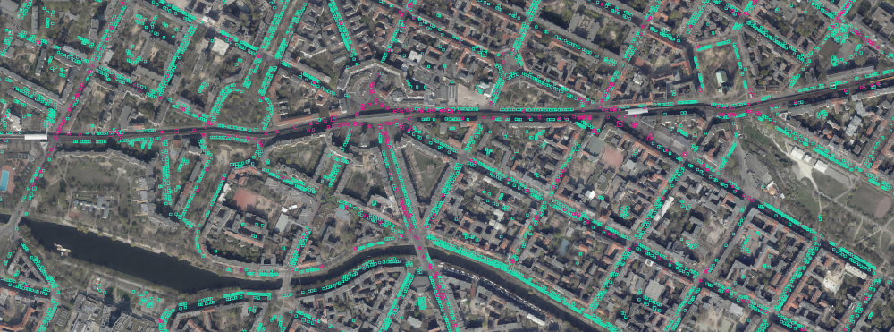
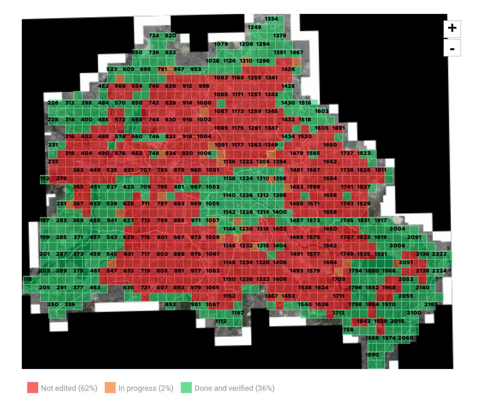

# Car tagging data - Berlin



This repo is about the **data** collected by volunteers using a [map tagging tool](https://github.com/hanshack/map-tagging-tool) which was developed to tag cars on aerial images from the city of Berlin.
It is a work in progress but some areas of Berlin are complete and ready to be downloaded:
- [Friedrichshain-Kreuzberg](./cars-friedrichshain-kreuzberg.geojson.zip)

The data is subject to change. 

## Status

Large parts of the city center and the outskirts are complete. Here is a screen shot from the tagging tool taken on the 12.12.2020

<p align="center">
  
</p>

## About the aerial images

The aerial images were captured on the 1. and 6. of April 2019 on behalf of the city of Berlin. According to the Senatsverwaltung für Stadtentwicklung, Bauen und Wohnen, everything approximately north of Rosenthaler Platz was captured on the 1st of April, whereas everything south of Rosenthaler Platz was captured on the 6th of April. A [GeoJSON](./date-indicators.geojson) with clues to the date of recording (for example markets) has been added to this repo. 

Link to the official dataset: https://fbinter.stadt-berlin.de/fb?loginkey=showMap&mapId=k_luftbild2019_rgb@senstadt

## The data
The data is in the commonly used GeoJSON format. It contains a collection of features of which each represents a tagged car by a square.
Each car has the following properties:
- size: ```sm | md | lg | xl (sizes do not necessarily represent different vehicle types)```
- inMotion: ```0|1 (no|yes)``` 

Example for a small car in notion:
```
{ 
	"type": "Feature",
	"properties": { 
		"size": "sm", 
		"inMotion": 1 
	}, 
	"geometry": { "type": "Polygon", "coordinates": [ [ [ 13.373293088785752, 52.503429881998635 ], [ 13.373209513826753, 52.503429881998635 ], [ 13.373209513778393, 52.503480755240851 ], [ 13.373293088834115, 52.503480755240851 ], [ 13.373293088785752, 52.503429881998635 ] ] ] } 
}
``` 
You can currently download the data for the district of [Friedrichshain-Kreuzberg](./cars-friedrichshain-kreuzberg.geojson.zip). The folder _raw-data.zip_ contains all the data collected so far but it isn't parsed and merged yet. 

## Bias

Even though the data has been double checked, be aware that this data may be bias. 
- Some things may have been tagged which are not a car. 
- Some cars have remained undetected - simply overlooked or were not visible since some areas are too dark (shadows etc.).
- The property "inMotion" may not be correct. 

## Possible use cases - some ideas

- How much space do cars take up?
- How much parking space do cars take up?
- Where parking data exists: compare official number with cars actually parked there.
- Visual representation
- Compare tagged cars with official data 
- A training dataset for machine learning
- Analyze informal parking (not on streets and parking lots)
- Parking violations
- Parking distribution
- Parking spaces without cars
- Parking space compared to living space

## Some useful resources 

- Motorization level in Berlin (31.12.2017): https://s3.kleine-anfragen.de/ka-prod/be/18/20848.pdf
- A collection of official parking space in Berlin: https://github.com/vizsim/parkraumbewirtschaftung_berlin
- Some research into car sizes in Germany: https://www.rnd.de/wirtschaft/datenanalyse-autos-werden-nicht-erst-seit-dem-suv-boom-grosser-6GTM66RRNJEC7EYHR3FQS7Y24Y.html
- Kraftfahrt-Bundesamt data: https://www.kba.de/DE/Statistik/Produktkatalog/produktkatalog_node.html
- Straßenbefahrung 2014: https://fbinter.stadt-berlin.de/fb/index.jsp?loginkey=zoomStart&mapId=k_StraDa@senstadt&bbox=385391,5816815,385677,5817005
- Wohnfläche je Einwohner 2019 in m²: https://www.statistik-berlin-brandenburg.de/regionalstatistiken/r-gesamt_neu.asp?Ptyp=410&Sageb=31000&creg=BBB&anzwer=0
- Amount of cars in Berlin: https://www.statistik-berlin-brandenburg.de/produkte/produkte-langereihen.asp and https://www.statistik-berlin-brandenburg.de/statistiken/langereihen/dateien/Strassenverkehr.xlsx

## Contact 

I would be happy to hear if you worked with this data set. If you want to help creating more data sets by tagging cars on satellite images yourself or have any other questions you can contact me via: car.tagging.berlin@posteo.de

## License 

The dataset is published under [ODbL license](https://opendatacommons.org/licenses/odbl/)
